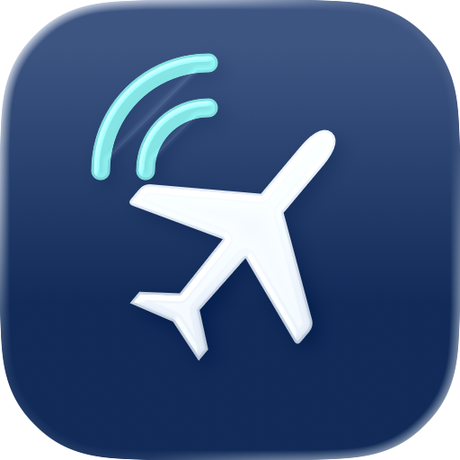
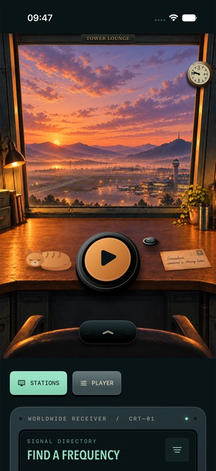

# Tower Lounge

**This project is vibe-coded.**

A cozy airport listening room for iOS and macOS, combining airport radio with ambient music. Settle into an illustrated control tower with time-of-day scenes, custom controls, and a sleepy cat.

The idea for Tower Lounge was inspired by [Listen to the Clouds](https://listentothe.cloud/).

[Privacy policy](https://www.jan-huber.ch/tower-lounge/privacy-policy/) · [Contact and support](https://www.jan-huber.ch/tower-lounge/contact/)

## Getting started

Open `TowerLounge.xcodeproj` in Xcode to build for iOS or macOS.

## Local station catalog

The station catalog is intentionally **not committed**. Supply a catalog you are authorized to use at `TowerLounge/Data/default_stations.json`. Its format is an array of `Station` objects; see `examples/default_stations.example.json` for a fictional, non-playable example. Without a local catalog, the app builds with an empty station list.
